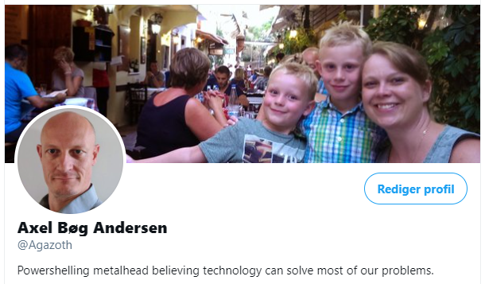
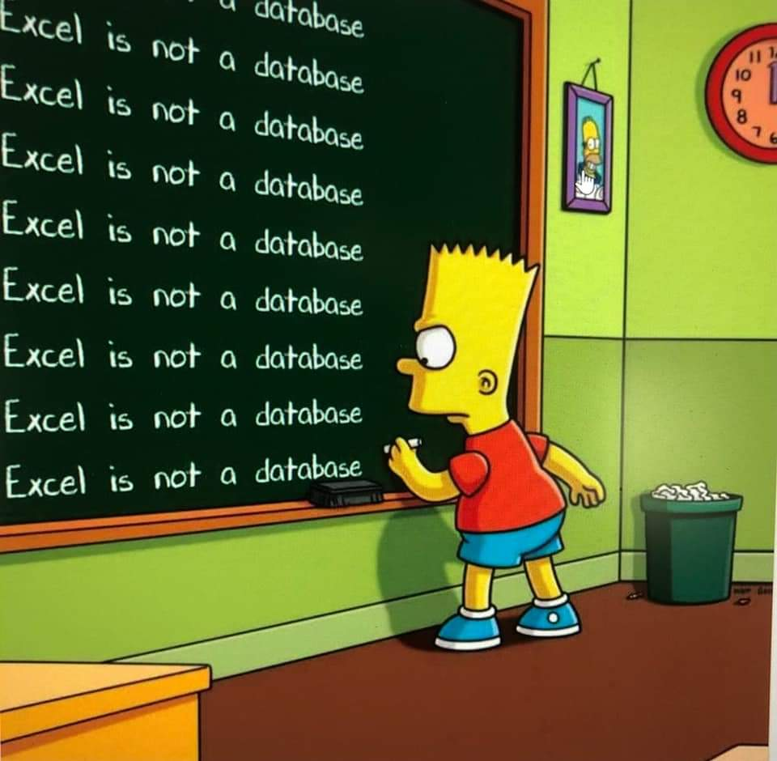

# Power Apps

  
Who am I?

## Axel Bøg Andersen

*Senior Cloud Architect - DevOps Engineer*

20+ år i IT med fokus på automatisering og cloud

  
Why, what and how

## Forhistorie

* Excel
* Mail
* Afdelingsdrev

## Formål

* Sikre data
* Sikre flows

## Metode

* No code
* Any platform

  
Case 1 - Poor consultants

## Udfordring

* Månedlig kørselsafregning
* Excel
* Mail

  
Case 2 - GDPR, and human errors

## Nyansættelse

* Sensitive data
* Mange brugere og arbejdsgange
* Data i mail
* Data i Excel
* Data i databaser

  
Case 3 - The noble cause

## Forskningsdata

* Fra idé til produkt

